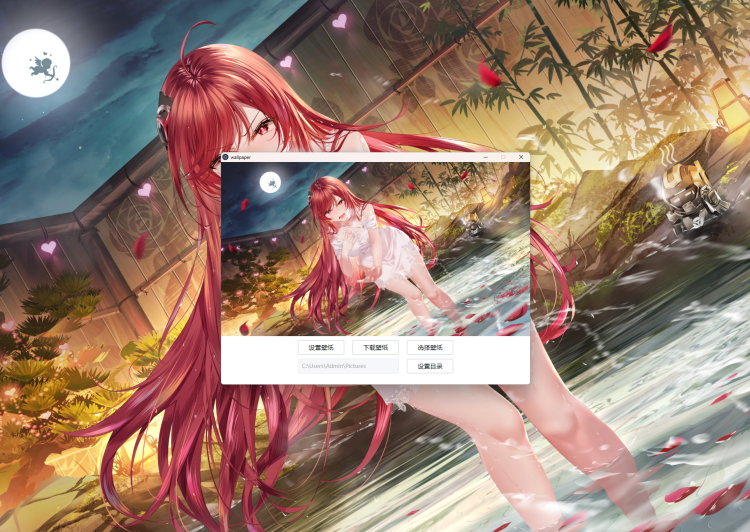
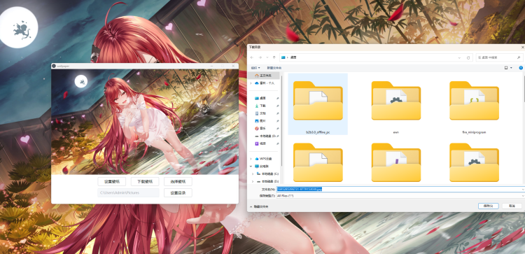

### wallpaper-electron 前端 
#### 1.安装依赖 pnpm install 
#### 2.启动 pnpm dev
#### 3.打包exe pnpm build:win
### wallpaper-serve 服务端  
#### 1.安装依赖 pnpm install 
#### 2.启动 pnpm start:dev
#### 3.打包 pnpm build
功能如下:

1. 设置壁纸
2. 下载壁纸
3. 选择壁纸并下载
4. 设置目录

项目截图

